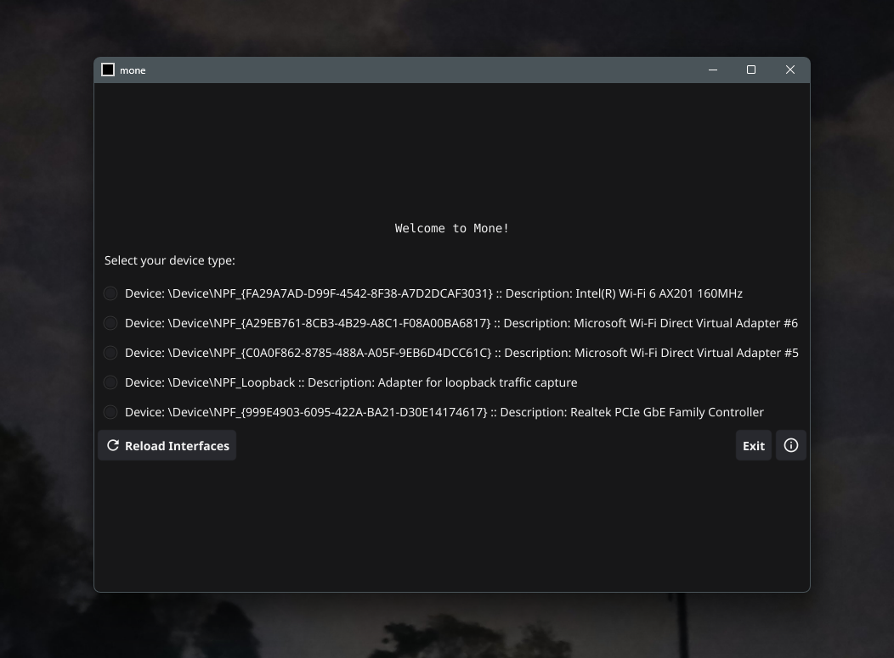
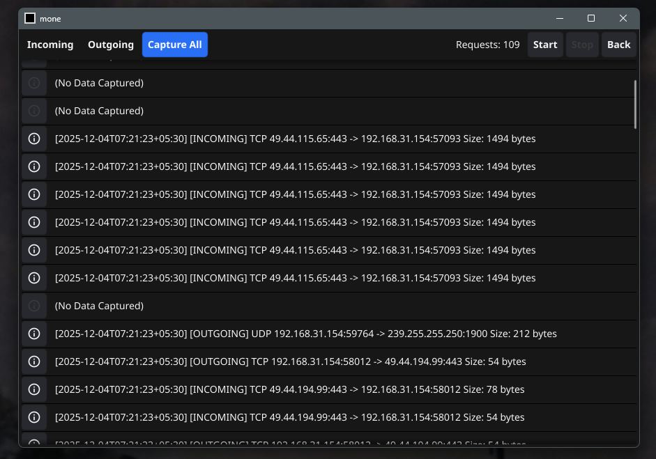
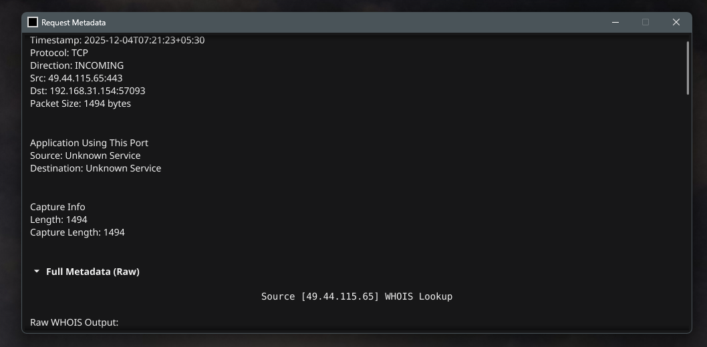

# mone

**mo**nitor + **ne**twork = **mone**

A lightweight network monitoring desktop application built with Go and Fyne.

## Features

### Network Monitoring
- **Real-time Packet Capture** - Capture and analyze network packets in real-time
- **Multi-Interface Support** - Select and monitor from all available network interfaces
- **Traffic Direction Detection** - Automatically identify incoming and outgoing traffic
- **Protocol Analysis** - Support for TCP, UDP, and other network protocols

### Request Analysis
- **Detailed Packet Information** - View source/destination IPs, ports, and packet sizes
- **Timestamp Tracking** - Track exact time of each network request
- **Packet Metadata** - Access comprehensive metadata including capture length and raw data
- **WHOIS Integration** - Fetch WHOIS information for source and destination IPs
- **Port Service Detection** - Identify applications using specific ports


### Advanced Features
- **Promiscuous Mode** - Capture all network traffic on the selected interface
- **Flexible Filtering** - Filter by protocol, direction, and other criteria
- **Live Statistics** - Real-time request count and traffic monitoring
- **Application Info Window** - Built-in about section with version and developer info

## Screenshots

### 1. Interface Selection
Select the network interface you want to monitor from all available interfaces.

<p align="center">
  
</p>

### 2. Request Type Selection
View all network requests and select the request type you want to monitor.

<p align="center">
  
</p>

### 3. Request Metadata
Click the info (i) button to view detailed metadata for each request.

<p align="center">
  
</p>

## Tech Stack

- **Go** - Backend and core functionality
- **Fyne** - Cross-platform GUI framework
- **gopacket** - Network packet capture

## Project Structure

```
cmd/
  ├── services/    # Background services
  ├── types/       # Type definitions
  ├── ui/          # UI components and screens
  └── utils/       # Helper utilities and constants
```

## Running the Application

```bash
go run main.go
```

## Building

To build the executable:

```bash
go build -o mone.exe
```

## Contributing

Contributions are welcome! Feel free to:
- Report bugs and issues
- Suggest new features
- Submit pull requests
- Improve documentation

## License

This project is licensed under the terms included in the [LICENSE](LICENSE) file.

## Author

**Abhishek Pathak** ([@scorcism](https://github.com/scorcism))
